> [实验环境准备](#实验环境准备)
> 
> [迁移](#迁移)
> 
> [实验一：部署和连接数据库](#实验一部署和连接数据库)
> 
> [实验二：管理数据库的角色和权限](#实验二管理数据库的角色和权限)
> 
> [实验三：手动备份还原pg_dump和pg_restore](#实验三手动备份还原pg_dump和pg_restore)
> 
> [实验四：自动备份和时间点还原](#实验四自动备份和时间点还原)
> 
> [实验五：复制](#实验五复制)
> 
> [实验六：高可用和灾备](#实验六高可用和灾备)
> 
> [高级特性（可选实验）](#高级特性可选)
> 
&nbsp;
&nbsp;


## 实验环境准备
1. 登录Azure portal  
    使用用户名和密码登录[Azure Portal](https://portal.azure.com)  
    
2. 打开Azure Cloud Shell  
   点击此处使用Azure Cloud Shell  
      

    显示下图表示您已经成功开启Azure Cloud Shell  

      

3. 实验整体架构
   

   **注意**：本动手实验文档默认按Azure Global环境运行，探索对象主要是Azure Database for PostgreSQL的flexible server版本，该版本支持AzureGlobal和AzureChina（世纪互联）等所有Azure公有云

## 迁移

> 本实验使用PostgreSQL官方名为dvdrental的样本数据库，在Azure虚拟机中创建PostgreSql模拟本地环境，借助Azure DMS服务完成本地
> 
> PostgreSql到云上Azure Database for PostgreSql flexible server的数据库迁移

1. 创建一个预配的VM
   
- 1) 在Azure portal中搜索“虚拟机”，选择创建，注意要选择创建具有预先配置的虚拟机
 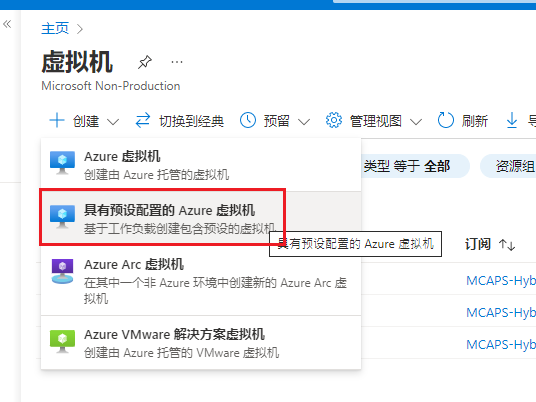

- 2）选择指定镜像，把这个VM放在PG-Workshop资源组里
 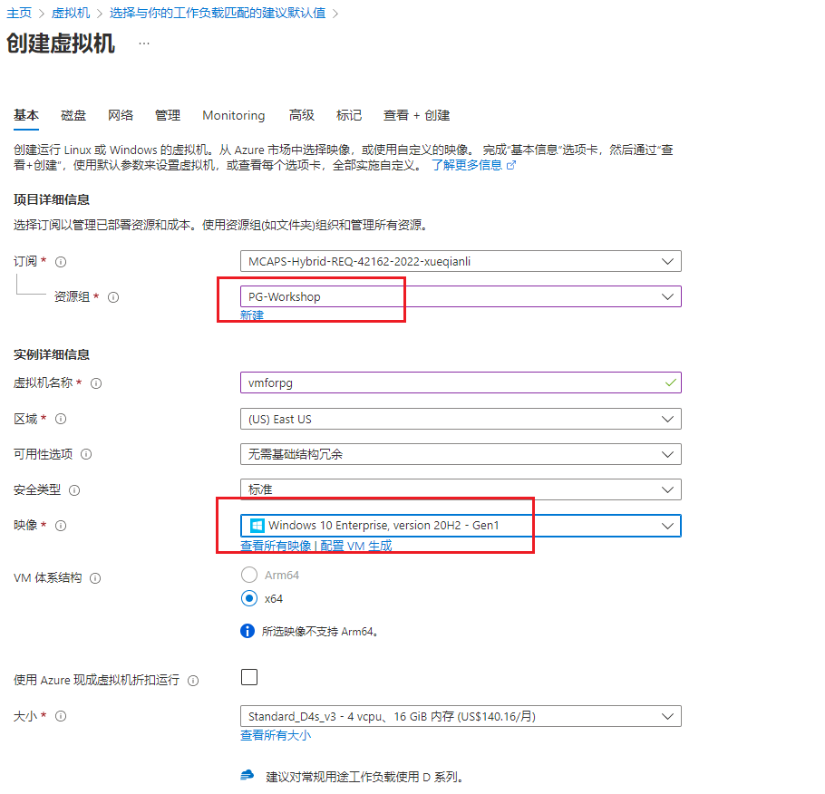

- 3）继续配置以下指定选项，设置登录VM的用户名密码，开启SSH和RDP端口
 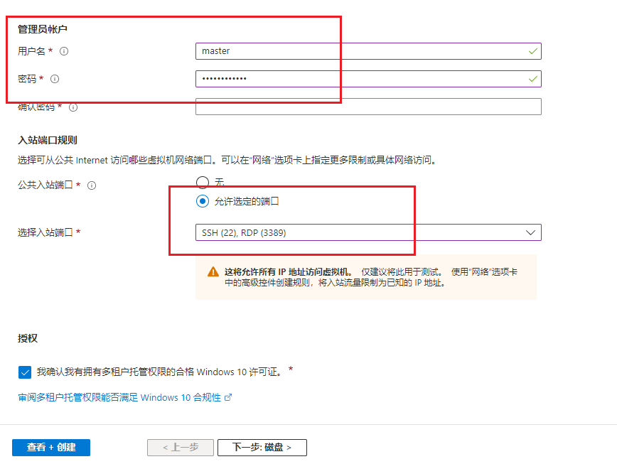

- 4）配置网络，将虚拟机放在hub-vnet子网中
 

- 5) 其他配置使用默认配置即可，点击查看+创建，创建VM

- 6）部署成功后可以在PG-Workshop资源组中查看创建的资源
  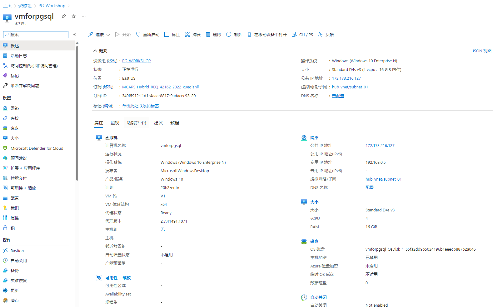

 **注意**：参考[快速入门：在 Azure 门户中创建 Windows 虚拟机](https://learn.microsoft.com/zh-cn/azure/virtual-machines/windows/quick-create-portal)
   

2. 在VM中部署数据库并且加载Sample数据库  
 
- 1）使用本机电脑的远程桌面连接第一步中创建的VM，填写连接ip,vm登录用户名和密码（创建时设置）
  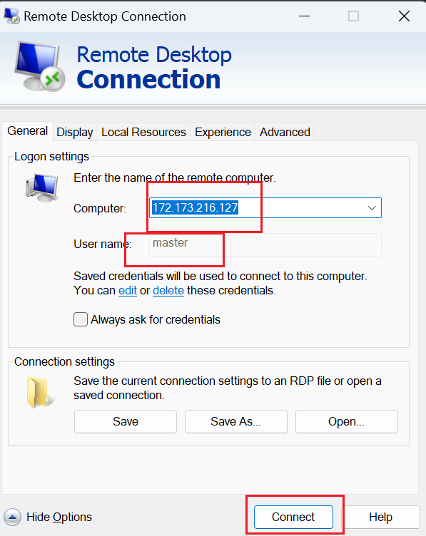

  其中连接ip可以在创建的vm的概述-公共ip处获取
  

  **注意**：如果连接不上，检查虚拟机-网络的入栈端口规则，如果没有开放3389端口，需要在网络选项卡内配置以下入站规则
  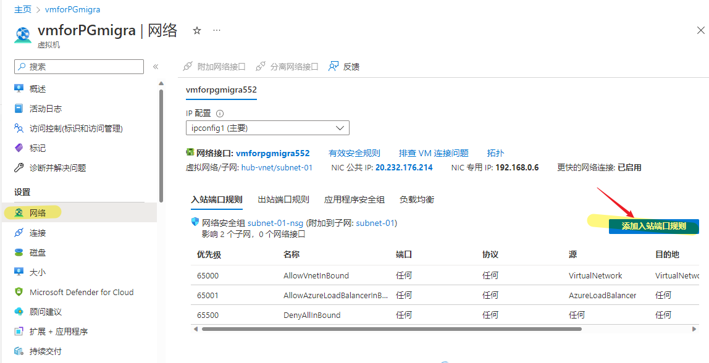
  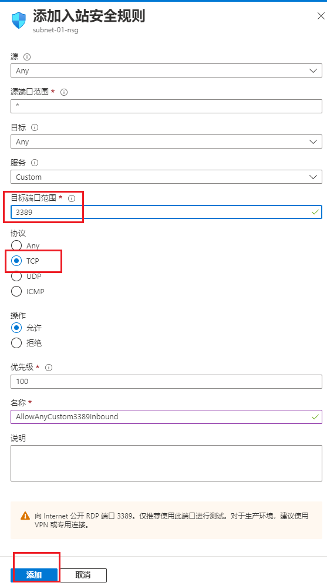

- 2）在VM中参考以下[链接](https://www.postgresqltutorial.com/postgresql-getting-started/install-postgresql/)，下载11.8或者12.3版本的PostgreSQL server并安装

- 3）在VM中连接本地的数据库,可以使用[psql工具或者pgAdmin工具](https://www.postgresqltutorial.com/postgresql-getting-started/connect-to-postgresql-database/)
  
- 4）在VM内的数据库中加载dvdrental样本数据库
  先下载[DVD Rental Sample Database](https://www.postgresqltutorial.com/postgresql-getting-started/postgresql-sample-database/)

  然后使用[pg_restore或者pgAdmin恢复样本数据库](https://www.postgresqltutorial.com/postgresql-getting-started/load-postgresql-sample-database/)

  **注意**：
  1）恢复数据库前要手动创建dvdrental数据库

  2）使用psql方法恢复数据库时， PostgreSQL安装目录的bin目录需要客户化为自己的，pg_restore命令需要替换为.\pg_restore（这是因为参考链接中的命令适用于linux系统，不适用鱼windows）


3. 在Azure portal创建Azure Database for PostgreSql  
   
- 1）在[Azure portal](https://portal.azure.com)搜索"postfresql"，选择Azure Database for PostgreSql服务器

- 2）创建时需要选择flexsible server灵活服务器版本


- 3）配置以下选项，配置数据库管理员用户名密码，放置在PG-Workshop资源组里，网络放在spoken-vnet中，其余默认即可，点击创建
    
    
    

- 4）部署成功后可以在PG-Workshop资源组中查看创建的资源
  


**注意**：可参考[此处详细教程](https://docs.azure.cn/zh-cn/postgresql/single-server/quickstart-create-server-database-portal)创建Azure Database for PostgreSql flexible server


4. 迁移环境准备
   
- 1）在VM中的 postgresql.config 文件中（在本机PostgreSQL安装路径的data目录下）启用逻辑复制，并设置以下参数：  

    wal_level = logical

    max_replication_slots = [槽数]，建议设置为“5 个槽”

    max_wal_senders =[并发任务数] - max_wal_senders 参数设置可以运行的并发任务数，建议设置为“10 个任务”

- 2）在VM中的 pg_hba.conf 文件中（在本机PostgreSQL安装路径的data目录下）加入云上的PostgreSQL所在DNS的ip
  
  
- 3）打开 Windows 防火墙，使 Azure 数据库迁移服务能够访问源 PostgreSQL 服务器（默认情况下为 TCP 端口 5432）
  [开放Windows防火墙5432端口](https://jingyan.baidu.com/article/fd8044fa7fc3245030137a49.html#:~:text=%E5%9C%A8%E9%98%B2%E7%81%AB%E5%A2%99%E9%9D%A2%E6%9D%BF%E4%B8%AD%E5%8D%95%E6%9C%BA%EF%BC%9A%E9%AB%98%E7%BA%A7%E8%AE%BE%E7%BD%AE%202%2F7%20%E5%8F%B3%E9%94%AE%E2%80%9C%E2%80%9D%E5%85%A5%E7%AB%99%E8%A7%84%E5%88%99%E2%80%9C%E2%80%9D%EF%BC%8C%E9%80%89%E6%8B%A9%EF%BC%9A%E6%96%B0%E5%BB%BA%E8%A7%84%E5%88%99,3%2F7%20%E9%80%89%E6%8B%A9%EF%BC%9A%E7%AB%AF%E5%8F%A3---%E4%B8%8B%E4%B8%80%E6%AD%A5%204%2F7%20%E9%94%AE%E5%85%A5%E8%A6%81%E5%BC%80%E6%94%BE%E7%9A%84%E6%8C%87%E5%AE%9A%E7%AB%AF%E5%8F%A3%EF%BC%8C%E4%B8%8B%E4%B8%80%E6%AD%A5)

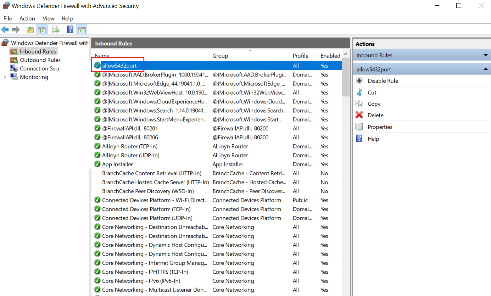
  

5. 迁移schema
   
- 1）使用本地VM的pgAdmin工具连接云上的postgreSQL数据库，参考[pgAdmin连接数据库](https://www.postgresqltutorial.com/postgresql-getting-started/connect-to-postgresql-database/)

  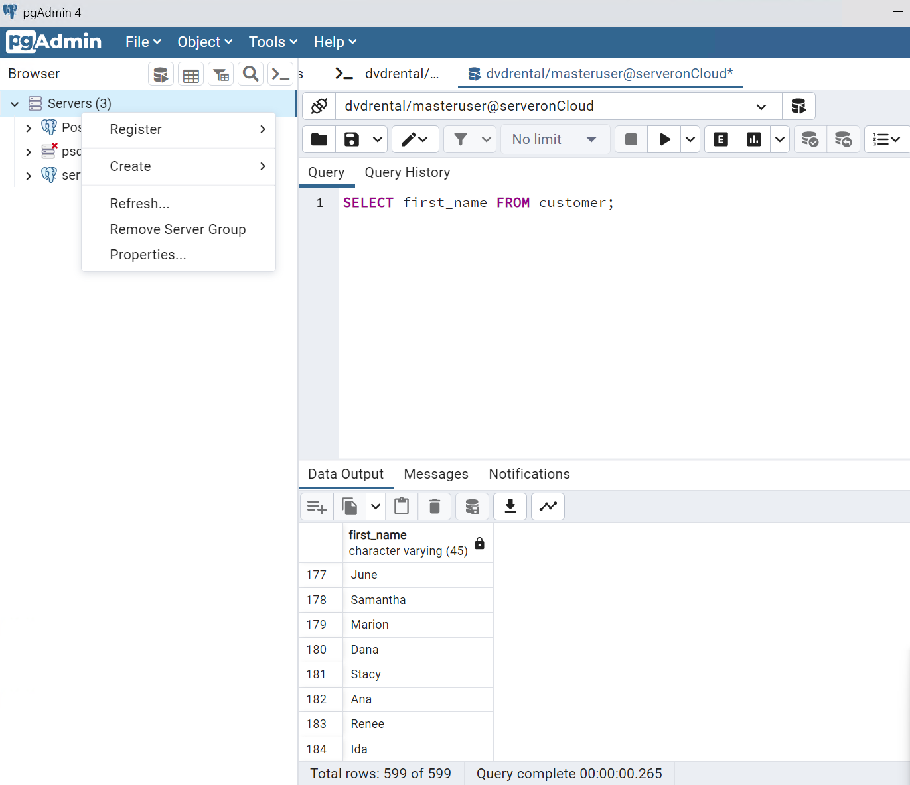

  连接后可以直接在本地的pgadmin中操作云上的postgreSQL数据库

- 2) 在VM的postgreSQL安装目录data目录下，使用powershell
  ```bash
    .\pg_dump -o -h localhost -U postgres -d dvdrental -s -O -x > dvdrentalSchema.sql
  ```
- 3）在云上的postgreSQL数据库创建一个空的数据库，也叫dvdrental，可以直接在pgAdmin中操作
  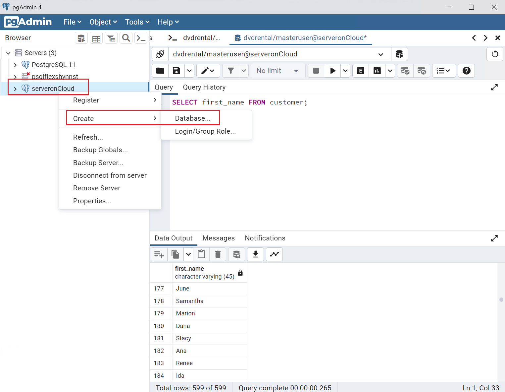

- 4）通过还原架构转储文件，将架构导入已创建的目标数据库
  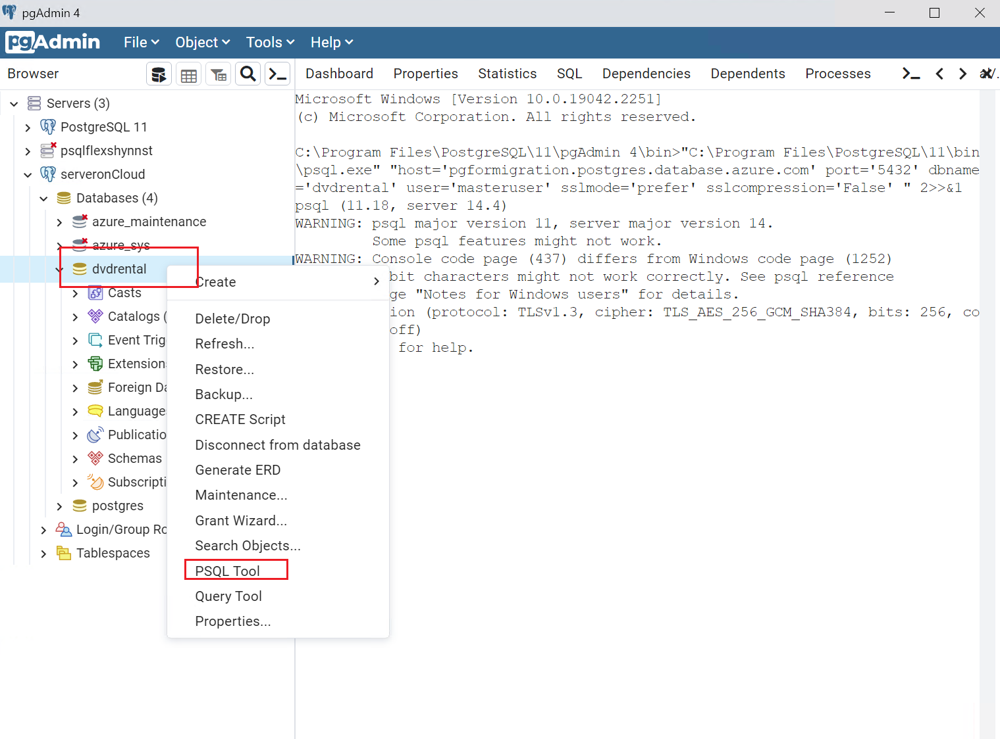

  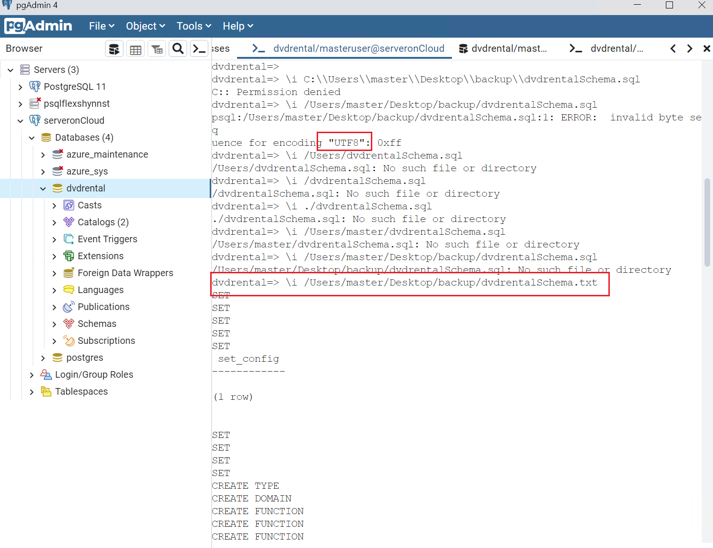

**注意**：转储schma时，需要注意文件必须是utf-8编码，且路径写法正确，才能成功导入

6. 创建部署Azure Data Migration Service完成迁移
   
参考[此处](https://docs.azure.cn/zh-cn/dms/tutorial-postgresql-azure-postgresql-online-portal)在Azure portal中创建Azure Data Migration Service服务

**注意**：
1) 创建Azure Data Migration Service时必须要选择4-core的premium的sku的DMS,否则无法新建postgreSQL的迁移project
2) 创建活动时，加密连接暂时不要勾选，源服务器名称填写VM的私有ip即可
   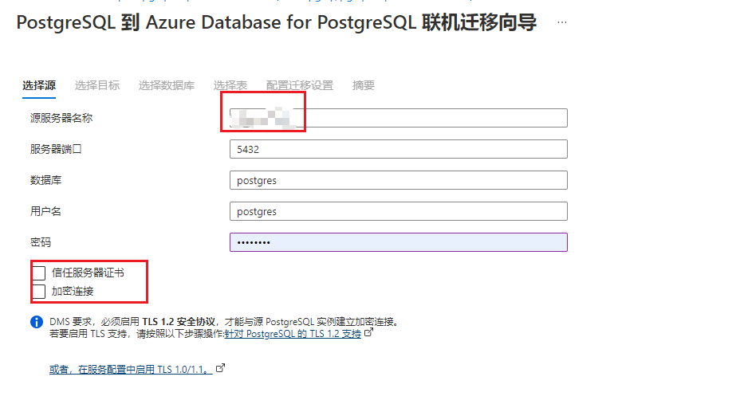


## 部署
### 实验一：部署和连接数据库
1. 使用Bicep部署数据库  

    - 安装bicep
         ```bash
        az bicep install
        ```
        
    - 下载bicep模板
        ```bash
        wget https://storageaccounthol.z6.web.core.windows.net/scripts/bicep.zip
        ```
        
    - 压缩下载文件
        ```bash
        unzip bicep
        ```
        
    - 创建一个名为PG-Workshop的资源组来部署实验资源
        ```bash
        az group create -l Eastus -n PG-Workshop
        ```
        
    - 使用bicep模板部署
        ```bash
        az deployment group create --resource-group PG-Workshop --template-file bicep/main.bicep
        ```
        需要为跳板机和数据库分别设置管理用户名和密码，部署需要十几分钟时间，如果部署失败可以多执行几次，直到部署成功以后将会出现以下输出： 

        
        
        之后您可以在名为PG-Workshop的资源组看到部署后的资源：  

        

2. 连接数据库  
   
   使用Azure Cloud Shell连接跳板机DNS VM，然后通过DNS VM连接数据库。  
  
    - 在Azure Cloud Shell中通过ssh连接跳板机
        ```bash
        ssh username@<jumpbox-ip> # 您设置的登录DNS VM的IP地址和用户名
        ```
    - 登录后安装psql（如未安装）
        ```bash
        sudo dnf module enable -y postgresql:13
        sudo dnf install -y postgresql
        ```
        
        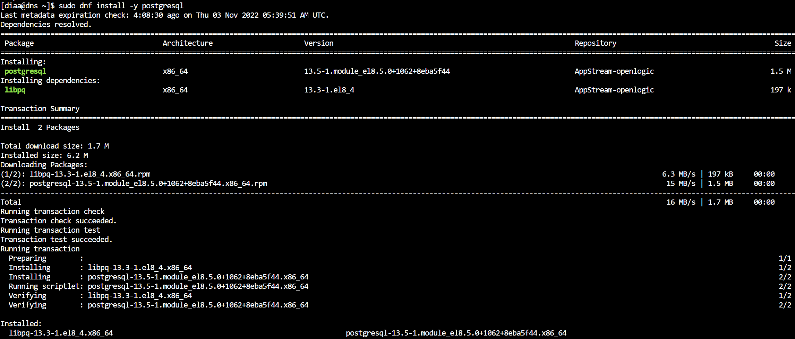

    - 通过预先配置连接参数快速连接数据库
      - 在Azure portal左栏位“Connection Strings”处找到psql字段

        

      - 在跳板机上创建配置文件
        ```bash
        vi .pg_azure
        ```  
        文件中配置以下内容:  
        ```bash
        export PGDATABASE=postgres
        export PGHOST=[YOURHOST]
        export PGUSER=[YOURUSER]
        export PGPASSWORD=[YOURPASSWD]
        export PGSSLMODE=require
        ```
      - 读取配置文件
        ```bash
        source .pg_azure
        ```
      - psql连接数据
        ```bash
        psql
        ```
        

3. 数据引入
    ```bash
    CREATE DATABASE quiz;
    \connect quiz

    CREATE TABLE public.answers (
        question_id serial NOT NULL,
        answer text NOT NULL,
        is_correct boolean NOT NULL DEFAULT FALSE
    );

    CREATE TABLE public.questions (
        question_id integer NOT NULL,
        question text NOT NULL
    );

    ALTER TABLE ONLY public.answers
        ADD CONSTRAINT answers_pkey PRIMARY KEY (question_id, answer);

    ALTER TABLE ONLY public.questions
        ADD CONSTRAINT questions_pkey PRIMARY KEY (question_id);

    ALTER TABLE ONLY public.answers
        ADD CONSTRAINT question_id_answers_fk FOREIGN KEY (question_id) REFERENCES public.questions(question_id);

    CREATE SCHEMA calc;
    CREATE OR REPLACE FUNCTION calc.increment(i integer) RETURNS integer AS $$
            BEGIN
                    RETURN i + 1;
            END;
    $$ LANGUAGE plpgsql;

    CREATE VIEW calc.vista AS SELECT $$I'm in calc$$;

    CREATE VIEW public.vista AS SELECT $$I'm in public$$;

    INSERT INTO public.questions (question_id, question) VALUES (1, 'Jaki symbol chemiczny ma tlen?');

    INSERT INTO public.answers (question_id, answer, is_correct) VALUES (1, 'Au', false);
    INSERT INTO public.answers (question_id, answer, is_correct) VALUES (1, 'O', true);
    INSERT INTO public.answers (question_id, answer, is_correct) VALUES (1, 'Oxy', false);
    INSERT INTO public.answers (question_id, answer, is_correct) VALUES (1, 'Tl', false);
    ```
    查看刚刚创建的表和视图：

    

    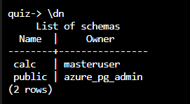

4. 管理PostgreSQL数据库
   - 管理存储和计算

    

   - 开启pgbouncer服务器参数  

    > 内置连接池是一项可选服务，可以再每个数据库服务器启用，并支持公有和私有访问。启用后，PgBouncer 将在数据库服务器上的端口 6432 上运行。PgBouncer 目前不支持可突发服务器计算层。

    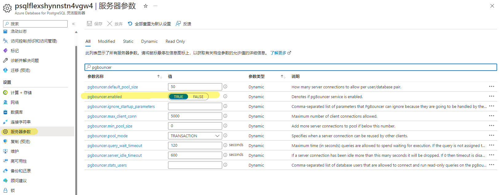

   - 使用服务锁  

    > 如果你删除了某个服务器，则也会删除属于该服务器的所有备份，且不可恢复。 为了帮助防止服务器资源在部署后遭意外删除或更改，管理员可以使用管理锁。

    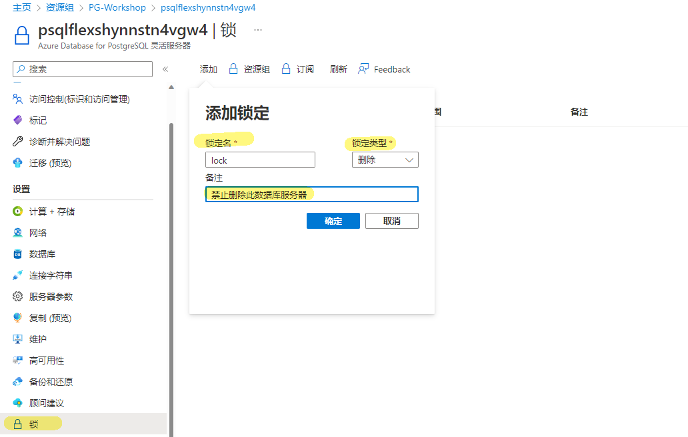

### 实验二：管理数据库的角色和权限
> 本部分实验探索用户组的权限继承，如果用户没有继承用户组的权限，就不能享受用户组已有的权限，但可以单独给该用户设置权限  

   - 按之前章节介绍的方法连接数据库
   - 创建新的用户组monty_python
      ```bash
        postgres=> CREATE GROUP monty_python;
        ```  
   - 创建该用户组的两个新用户Graham和Eric，Graham不继承用户组权限，Eric继承用户组权限，每个用户最大允许两个连接
      ```bash
        postgres=> CREATE USER Graham CONNECTION LIMIT 2 IN ROLE monty_python NOINHERIT;
        postgres=> CREATE USER Eric CONNECTION LIMIT 2 IN ROLE monty_python INHERIT;
        ``` 
   - 显示集群中的所有角色
      ```bash
        postgres=> \dg
        ```         
        

   - 连接到数据引入时创建的quiz数据库
      ```bash
        postgres=> \c quiz
        ```           
   - 把quiz数据库中所有表的权限赋予用户组monty_python，切换用户，Graham应该无法读取quiz数据库中的表，而Eric可以读取
      ```bash
        quiz=> GRANT ALL ON ALL TABLES IN SCHEMA public TO monty_python;
        
        quiz=> GRANT graham to masteruser;
        quiz=> GRANT eric to masteruser;

        quiz=> SET ROLE TO graham;
        SET
        quiz=> TABLE answers;
        ERROR:  permission denied for table answers

        quiz=> SET ROLE TO eric;
        SET
        quiz=> table answers;
        question_id | answer | is_correct
        -------------+--------+------------
                1 | Au     | f
                1 | O      | t
                1 | Oxy    | f
                1 | Tl     | f
        (4 rows)

        ``` 
   - 切换为超级管理员账户给Graham设置查询权限,可以查看answer表
      ```bash        
        quiz=> SET ROLE TO adminuser;
        SET
        quiz=> GRANT SELECT ON TABLE answers TO Graham;
        GRANT

        quiz=> SET ROLE TO graham;
        SET
        quiz=> TABLE answers;
        question_id | answer | is_correct
        -------------+--------+------------
                1 | Au     | f
                1 | O      | t
                1 | Oxy    | f
                1 | Tl     | f
        (4 rows)
        ```

## 可用性和业务连续性
### 实验三：手动备份还原pg_dump和pg_restore
> 这类方法可以用来手动备份整个数据库或者某个单独的数据库。

> pg_dump只备份数据库集群中某个数据库的信息，不会导出角色和表空间相关的信息。

> pg_dumpall可以对数据库集群以及全局对象进行备份。
    
1. 情景1：对普通单个数据库进行备份还原
   - 按实验一中的方法连接DNS VM虚拟机，运行以下命令为quiz数据库备份并且删除数据库
   ```bash
       source .pg_azure
       pg_dump quiz > /tmp/quiz.plain.dump
       less /tmp/quiz.plain.dump
       dropdb quiz
   ```
   再次进入quiz数据库显示不存在：
   

   - 使用psql还原数据库
   需要先自己创建对应的数据库
   ```bash
       createdb quiz
   ```
   quiz数据库被成功创建，但是内部没有任何关系和数据：

   

   ```bash
       psql -f /tmp/quiz.plain.dump quiz
       or
       psql quiz < /tmp/quiz.plain.dump
   ```
   再次进入quiz数据库，发现关系和数据已经被还原：
   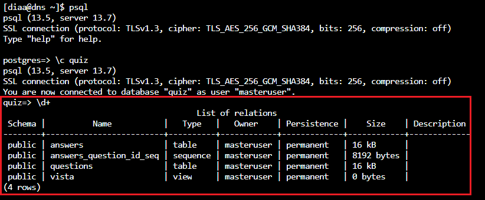

2. 情景2：对大型数据库使用压缩备份还原  

    > 对于大型数据库，可以使用pg_dump自带压缩功能，只需要压缩时使用-Fc参数，还原时只能使用pg_restore不能使用psql，感兴趣同学可以自行尝试
    ```bash
    pg_dump -Fc quiz > /tmp/quizCompressed.plain.dump
    pg_restore -d quiz /tmp/quizCompressed.plain.dump
    ```

3. 情景3：多线程备份还原
    > -Fd参数支持多线程备份还原数据，请按照情景1的步骤自行实验，最后进入quiz数据库查看数据是否被还原
    ```bash
    pg_dump quiz -Fd -f /tmp/directorydump
    zless /tmp/directorydump/*dat.gz
    dropdb quiz
    createdb quiz
    pg_restore -d quiz /tmp/directorydump
    ```
**注意**：如果未配置数据库连接参数文件，需要在备份和恢复语句中增加Host，username等参数，如

```bash
pg_dump -Fc -v --host=<host> --username=<name> --dbname=<database name> -f <database>.dump
pg_restore -v --no-owner --host=<server name> --port=<port> --username=<user-name> --dbname=<target database name> <database>.dump
```

### 实验四：自动备份和时间点还原
1. 自动备份 

    > 默认情况下，Azure Database for PostgreSQL 支持自动备份整个服务器（包括创建的所有数据库），自动备份包括数据库的每日快照备份，日志 (WAL) 文件持续存至 Azure Blob 存储

    > 备份保持期：备份保留期默认为 7 天。目前，灵活服务器支持自动备份最多保留 35 天。 可以使用手动备份来满足长期保留要求。

    > 备份频率：灵活服务器上的备份基于快照。第一次完整快照备份在创建服务器后立即进行。 之后每日创建一次。事务日志备份的发生频率不同，具体取决于工作负载和 WAL 文件已填充并准备好存档的时间。一般情况下，延迟最大可为15分钟。

    > 备份是使用快照执行的联机操作。快照操作只需几秒钟，不会干扰生产工作负载，可帮助确保服务器的高可用性。

    > 备份加密：在查询执行过程中创建的所有Azure Database for PostgreSQL 数据、备份和临时文件都通过AES 256位加密进行加密。存储加密始终处于启用状态，无法禁用。

    在这里可以更改备份保持期，修改后点击保存即可：

    

2. PITR还原

    > 在灵活服务器中，执行时间点恢复（PITR）会在源服务器所在的同一区域中创建新服务器，可以选择可用性区域。 

    > 该服务器是使用源服务器的定价层、计算代系、虚拟核心数、存储大小、备份保留期和备份冗余选项的配置创建的。 

    > 这种恢复方式只能恢复到一个新的服务器，而且HA配置不会还原

    > 恢复过程如下，先将物理数据库文件从快照备份还原到服务器的数据位置。 这会自动选择并还原所需时间点之前进行的相应备份。 然后，使用WAL文件启动恢复过程，使数据库处于一致状态。

    首先点击此处的“还原”：

    

    选择还原的时间点，把数据还原到一个新的数据库：

    

    等待部署完成，本次还原耗时约10min：

    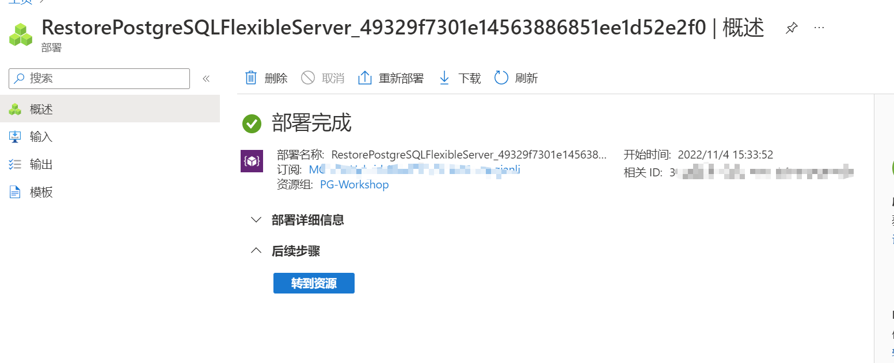


### 实验五：复制
> 使用 PostgreSQL 本机逻辑复制复制数据对象。 逻辑复制允许对数据复制（包括表级数据复制）进行精细控制。

> 发布服务器是从中发送数据的 PostgreSQL 数据库。订阅服务器是向其发送数据的 PostgreSQL 数据库。

1. 创建一个新的数据库服务器
   ```bash
    az postgres flexible-server create --vnet spoke-vnet --subnet subnet-02 --resource-group PG-Workshop \
    --name replication-flex --admin-user replica --admin-password 'PkG3zk&SKt' \
    --sku-name Standard_B1ms --tier Burstable --storage-size 128 \
    --tags "key=replica" --version 13 --high-availability Disabled
   ```
   输出如下图表示部署成功：
   

2. 修改服务器参数
   wal_level设置为logical
   max_worker_processes设置为16

   保存并且重启服务：
    
   
3. 连接原PostgreSQL 数据库，授予管理员用户复制权限
   ```sql
    ALTER ROLE <adminname> WITH REPLICATION;
   ```

4. 为表创建发布
   ```sql
    \c quiz
    CREATE PUBLICATION answers_pub FOR TABLE  answers;
   ```

5. 连接到订阅服务器，创建相同schema的表
   ```bash
   export PGPASSWORD='PkG3zk&SKt'; psql -d postgres  -U replica  -h replication-flex.postgres.database.azure.com
   ```
   ```sql
    CREATE DATABASE quiz;
    \connect quiz

    CREATE TABLE public.answers (
    question_id serial NOT NULL,
    answer text NOT NULL,
    is_correct boolean NOT NULL DEFAULT FALSE
    );
   ```
6. 为表创建发布的订阅
   ```sql
   CREATE SUBSCRIPTION sub CONNECTION 'host=192.168.1.132 user=diaa dbname=quiz password=@n6DnfN&P' PUBLICATION answers_pub;
   ```
   
7. 在订阅服务器上查询表，将会看到它从发布服务器接收数据
   ```sql
    table answers;
   ```

### 实验六：高可用和灾备
> 配置高可用性后，灵活服务器会自动预配和管理备用副本。 备用副本将部署在与主服务器完全相同的 VM 配置（包括 vCore、存储空间、网络设置 (VNET、防火墙)等）中。

> 使用 PostgreSQL 流式复制以同步模式将预写日志 (WAL) 流式传输到副本。应用程序读取操作直接从主服务器进行，而只有在主服务器和备用副本上保存了日志数据后，才会向应用程序确认提交和写入操作。由于这种额外的往返，预计会增加应用程序写入和提交操作的延迟。 

> 在典型情况下，从应用程序的角度而言，故障转移时间或故障时间介于60秒至120秒之间。 如果在长期事务、索引创建或大量写入活动的过程中发生中断，这个时间可能会更长，因为备用服务器需要更长时间才能完成恢复过程。由于复制是在同步模式下发生，因此不会有数据丢失。

> 可突发的计算层不支持高可用性。  

> **注意**：备用副本不同于只读副本，不支持读取查询

可以在此处选择启用高可用：

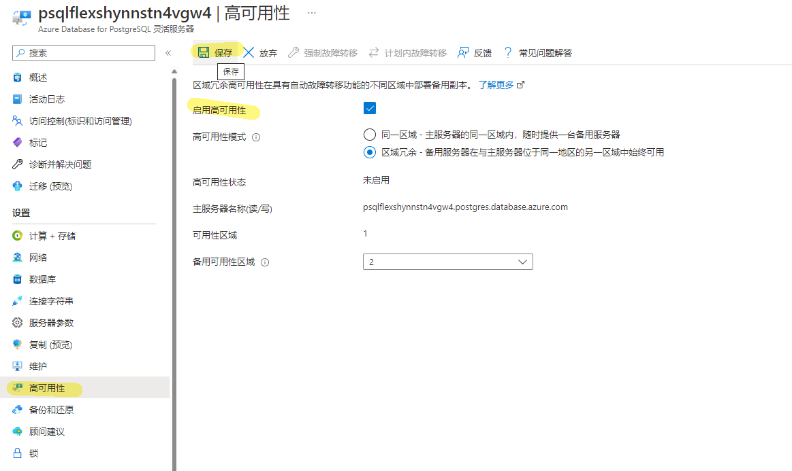

执行强制的故障切换：

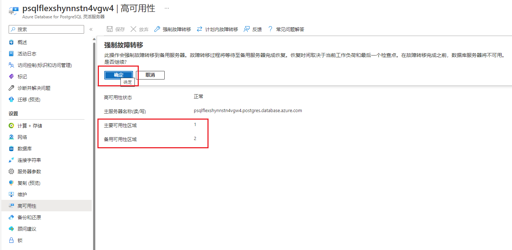

故障自动切换后，主服务器和从服务器交换，用时约2min：

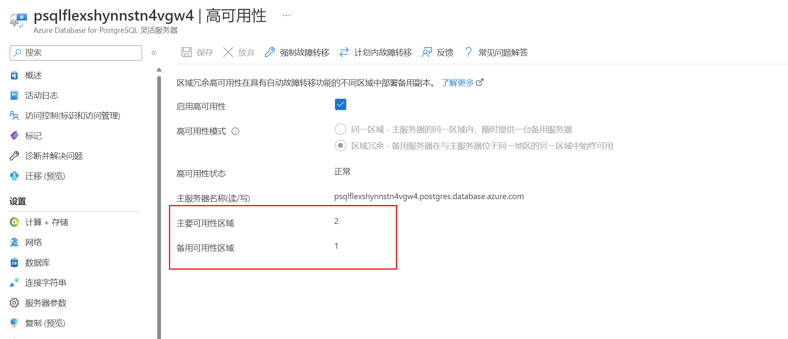    


## 高级特性（可选）
> 本部分实验链接如下[](https://storageaccounthol.z6.web.core.windows.net/)
1. 审计和维护
- 维护
   > 用户可以自定义维护时段
   > 参考[Patching and maintenance windows章节](https://storageaccounthol.z6.web.core.windows.net/)
   
   此处可以自定义服务维护时间：
   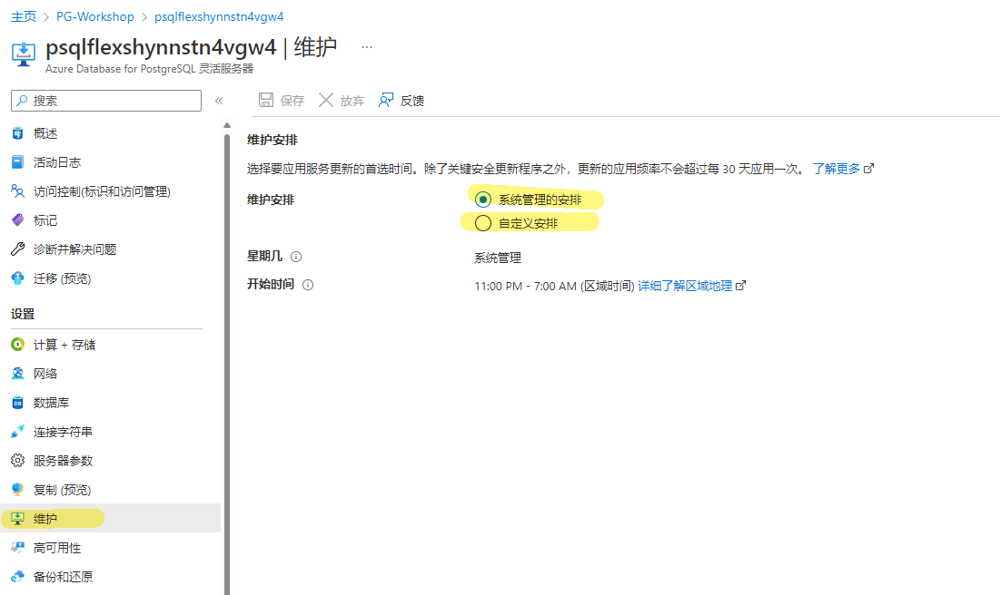 

- 审计
   > 使用pgAudit扩展审计数据库的活动日志
   > 参考[Security Management PostgreSQL章节](https://storageaccounthol.z6.web.core.windows.net/)

2. 监控数据库
   > 参考[Monitoring and Troubleshooting章节](https://storageaccounthol.z6.web.core.windows.net/)

3. 配置PgBadger
   > 参考[Configure PgBadger章节](https://storageaccounthol.z6.web.core.windows.net/)

4. 探索MVCC
   > 参考[Multiversion Concurrency Control, MVCC章节](https://storageaccounthol.z6.web.core.windows.net/)

5. SQL特性
   > 参考[SQL Characteristic章节](https://storageaccounthol.z6.web.core.windows.net/)

6. 查询优化
   > 参考[Statistics and Query Planning章节](https://storageaccounthol.z6.web.core.windows.net/)
